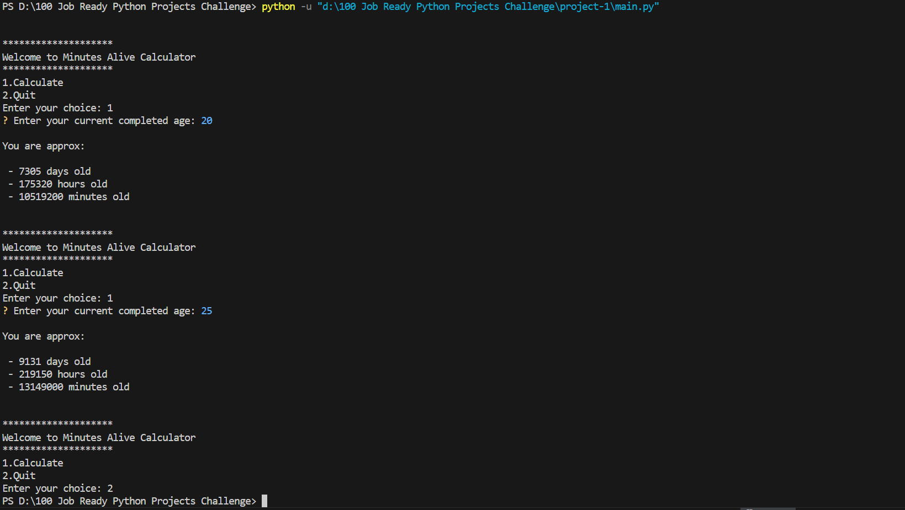

# 01 - Minutes Alive Calcular (CLI)

A simple Command Line Interface (CLI) to calculate total number of hours , minutes and seconds a person lived.
## 📝 Description

As a part of **100+ Python Project Challenge**, it is the 1st project. The goal of this project is to get familiar with basic syntax of Python. And simple use case of InquirerPy which will be covered in detail in the next projects of this challenge . Stay tuned !

## 🚀 Features
* **Basic Calculations** - Takes age from the user
* **Handling errors at most basic level** - Error handling is performed at basic level indicating the start from a basis level


## 🛠️ Tech-Stack
* **Languages** - Python 3.13.9
* **Modules** - 'datetime' , 'InquirerPy'

## ⚙️ Installation Guide
1. **Clone the repository:-**
   ```bash
   https://github.com/shravanshidruk16/Python-Projects-Basic-To-Advance.git
   cd 100 Job Ready Python Projects Challenge
   cd 01_minutes_alive_calculator

2. **Run the application**
   ```bash
   python main.py
3. **Follow the prompt**
   * Enter Your Age which is recently completed
## 📸 **Demo**

 **Output**
   


## ✍️ **Author**
* Shravan Shidruk
* Challenge: 100+ Important Python Project in 6 months