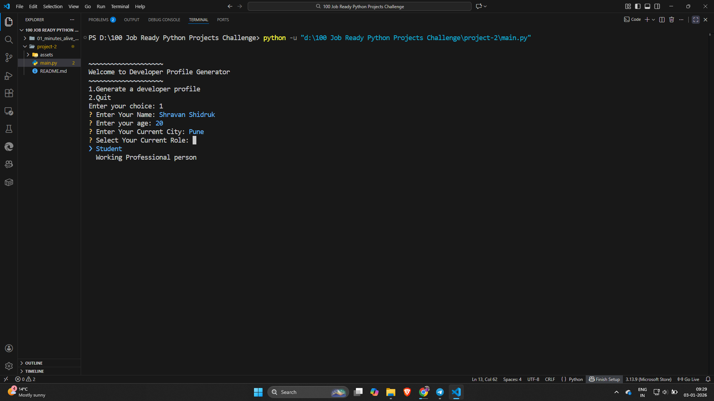
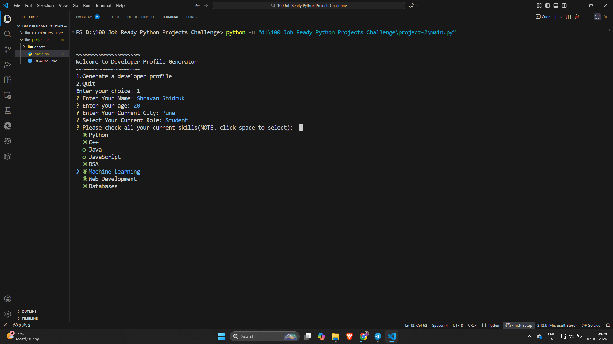
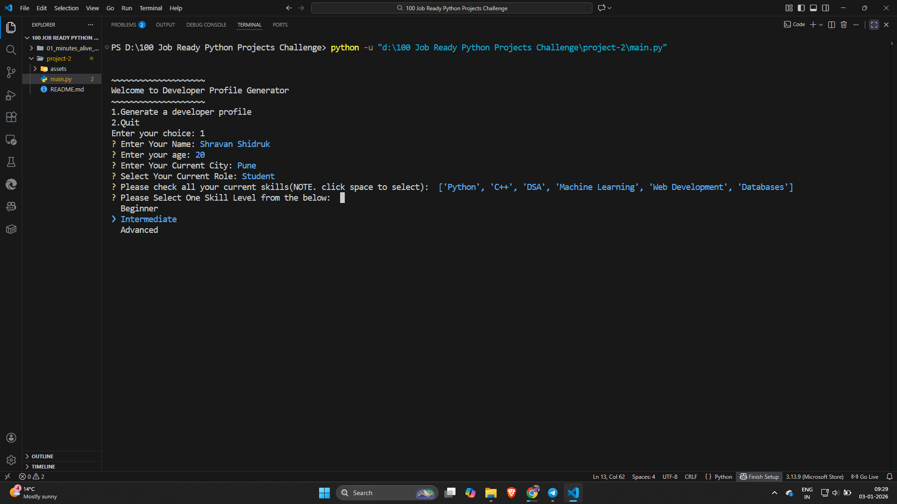
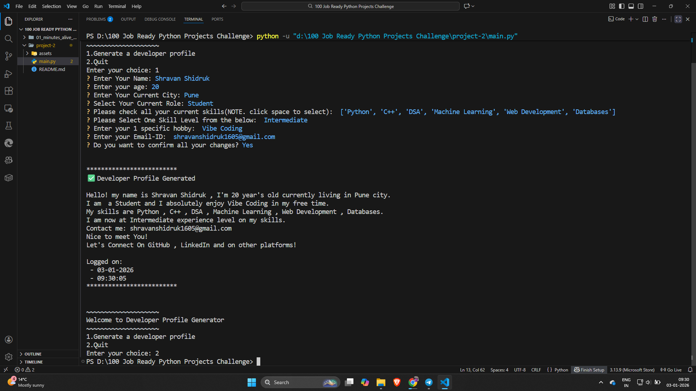

# 02 - Developer Profile Generator (CLI)

A simple Command Line Interface (CLI) to generate a developer profile quickly based on there answers to particular, required and most important questions

## 📝 Description

As a part of **100+ Python Project Challenge**, it is the 2nd project. The goal of this project is to get familiar with basic syntax of Python . And in this project I covered most important part of InquirerPy (CLI tool) syntax , it's use case and the final implementation with output.

## 🚀 Features

* **Modularity** - Implemented basic code modularity at beginner level

* **Logging in Python** - Used **datetime** module to implement logging 

* **F-strings** - Did best use of **F-strings** in this project

* **Handling errors at most basic level** - Restrictions on age entered by the user is handled by if-else statements and EmptyInputValidator by InquirerPy


## 🛠️ Tech-Stack
* **Languages** - Python 3.13.9
* **Modules** - 'datetime' , 'InquirerPy'

## ⚙️ Installation Guide
1. **Clone the repository:-**
   ```bash
   https://github.com/shravanshidruk16/Python-Projects-Basic-To-Advance.git
   cd 100 Job Ready Python Projects Challenge
   cd 02_developer_profile_generator

2. **Run the application**
   ```bash
   python main.py
3. **Follow the prompt**

    1. Enter Your Name

    2. Enter Your Age

    3. Enter Your Current City of Accomodation

    4. Select Your Role from the Dropdown list

    5. Add your skills with SPACEBAR and click ENTER to confirm

    6. Select Your Experience Level

    7. Enter Your Hobby

    8. Enter Your Email Address

    9. Press Y to confirm all your changes or N to re-enter them

    10. Your Developer Profile is ready to use ✅

## 📸 **Demo**

## 1. Implementation of **inquirer.select**


## 2. Implementation of **inquirer.checkbox**


## 3. Implementation of **inquirer.select**


## 4. Final output - **Developer Profile with logs**


## ✍️ **Author**
* Shravan Shidruk
* Challenge: 100+ Important Python Project in 6 months