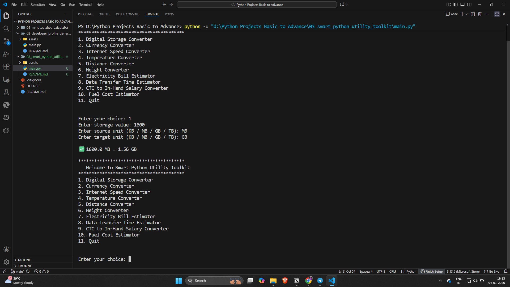
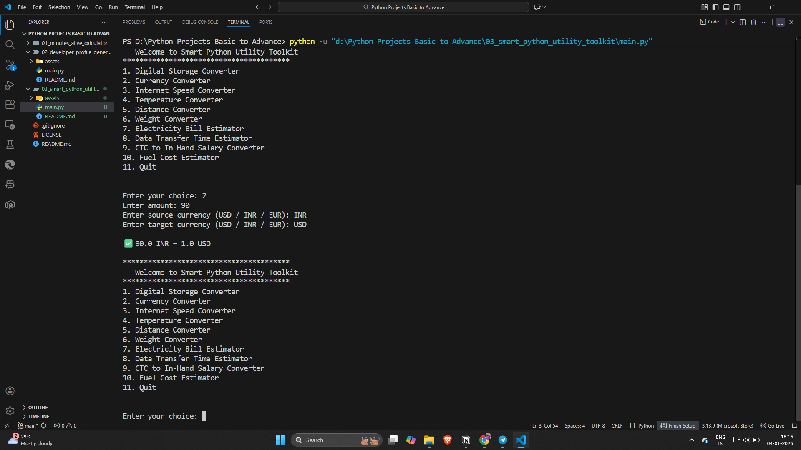
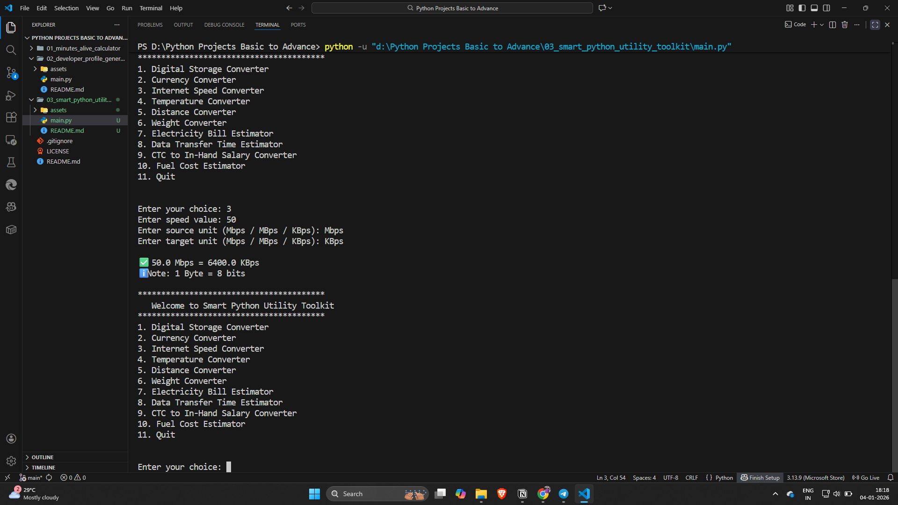
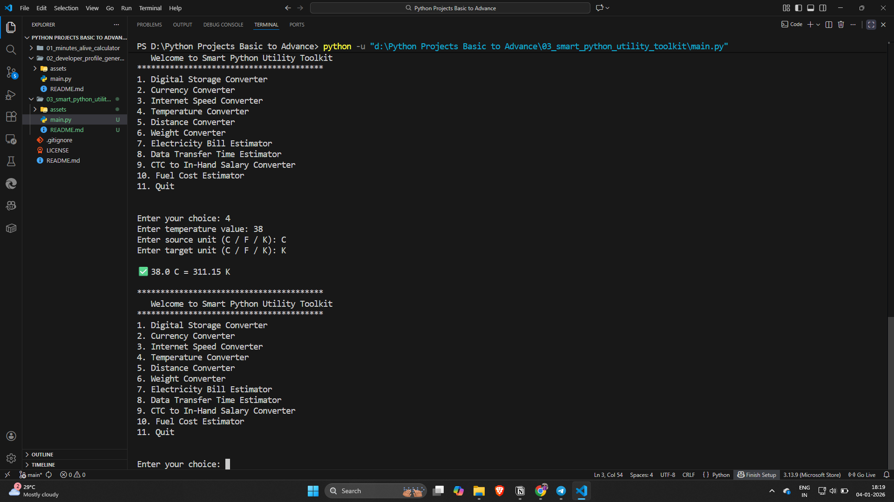
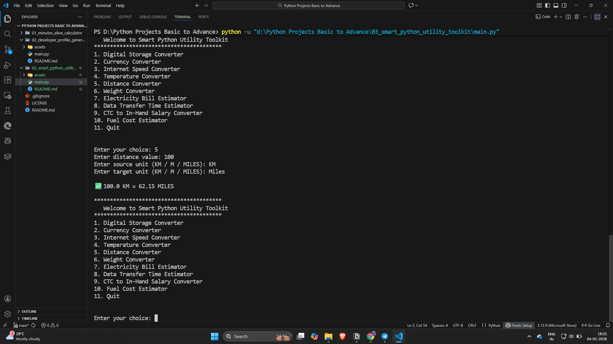
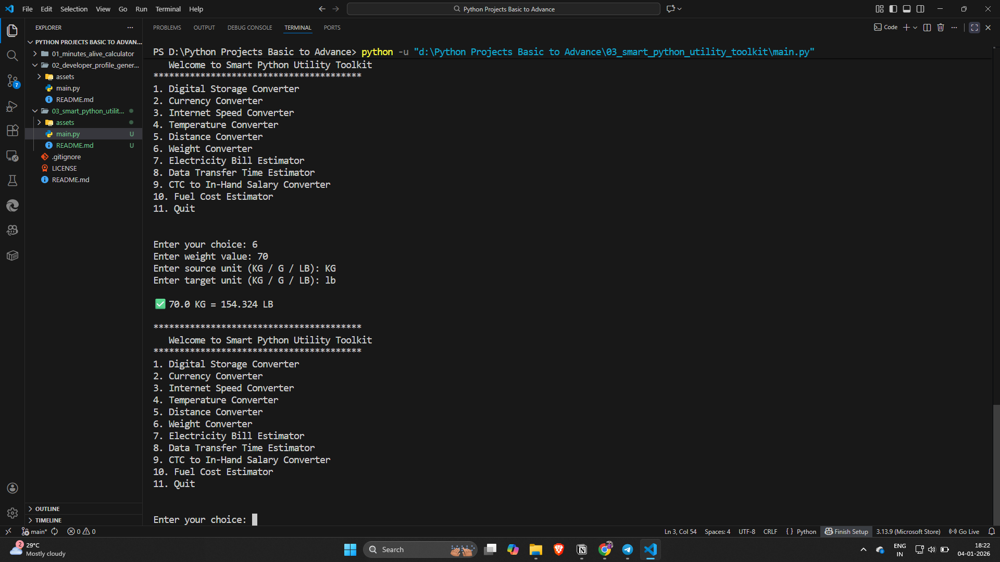
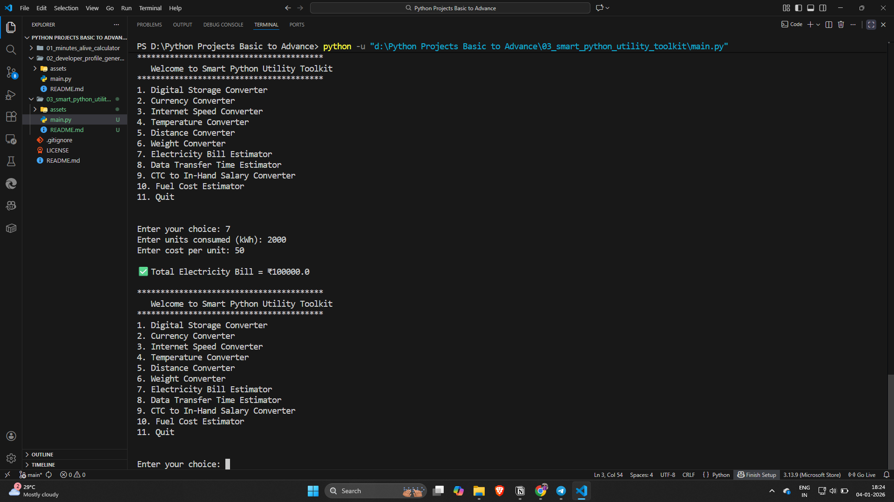
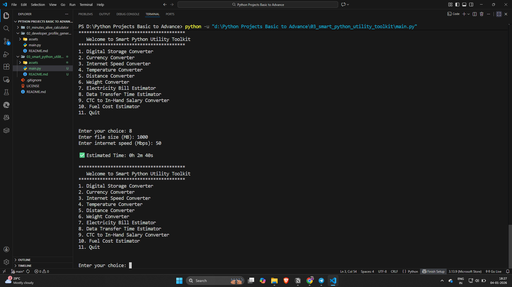
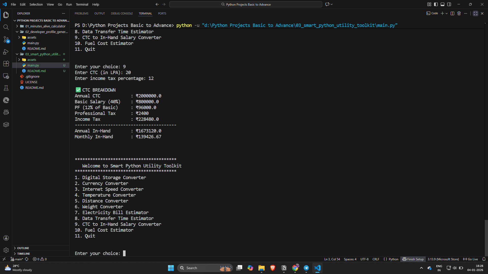
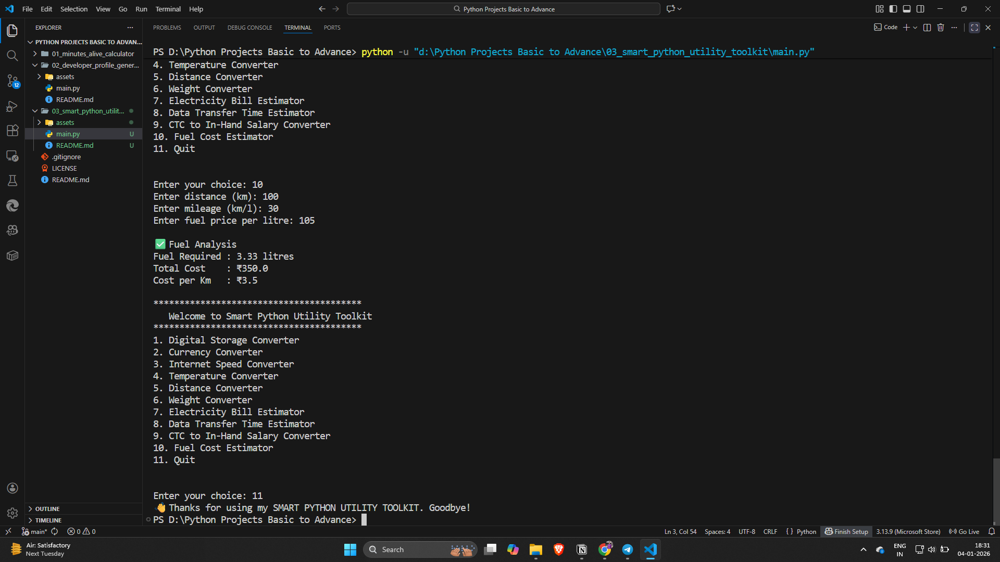

# 03 - Smart Python Utility Toolkit (CLI)

A menu-driven simple Command Line Interface (CLI) application that provides multiple real-life utility converters and estimators such as storage conversion, currency conversion, salary breakdown, fuel cost analysis, and more. It is made in an most easiest possible way and language inorder to understand maximum programming concepts in complicated conversions

## 📝 Description

As a part of 100+ Python Project Challenge, this is the 3rd project.
The main objective of this project is to strengthen Python fundamentals by implementing real-world use cases using functions, conditional logic, exception handling, and menu-driven program flow.

This project focuses on writing clean, modular, beginner-friendly yet practical Python code that can be extended in the future into GUI or web-based applications.

## 🚀 Features

* Menu Driven CLI Application – Easy navigation using numbered options
* Code Modularity – Each utility is implemented as a separate function
* Error Handling – Used try-except blocks to handle invalid numeric inputs safely
* Input Validation – Prevents invalid, negative, or zero values where applicable
* Real-Life Utilities implemented:
  - Digital Storage Converter
  - Currency Converter
  - Internet Speed Converter (Mbps / MBps / KBps)
  - Temperature Converter
  - Distance Converter
  - Weight Converter
  - Electricity Bill Estimator
  - Data Transfer Time Estimator
  - CTC to In-Hand Salary Converter
  - Fuel Cost Estimator
* Clean Output Formatting using f-strings

## 🛠️ Tech-Stack

Language  : Python 3.13.9

Concepts :
- Functions
- Conditional Statements
- Match Case
- Dictionaries
- Exception Handling
- Loops
- F-Strings

## ⚙️ Installation Guide

1. Clone the repository
    ```bash
   git clone https://github.com/shravanshidruk16/Python-Projects-Basic-To-Advance.git
   ```

2. Navigate to project directory
   cd Python-Projects-Basic-To-Advance
   cd 03_smart_python_utility_toolkit

3. Run the application
   python main.py

## ▶️ How to Use

1. Run the program using python main.py
2. Select the desired utility from the menu
3. Enter required values as prompted
4. Get instant, accurate results
5. Invalid inputs are handled gracefully

## 📸 **Demo**

## 1. Implementation of **Digital Storage Converter**


## 2. Implementation of **Currency Converter**


## 3. Implementation of **Internet Speed Converter**


## 4. Implementation of **Temperature Converter**


## 5. Implementation of **Distance Converter**


## 6. Implementation of **Weight Converter**


## 7. Implementation of **Electricity Bill Estimator**


## 8. Implementation of **Data Transfer Time Estimator**


## 9. Implementation of **CTC to In-Hand Salary Converter**


## 10. Implementation of **Fuel Cost Estimator**



## 📌 Learning Outcomes

* Improved understanding of menu-driven programs
* Strong command over Python functions and dictionaries
* Clear understanding of bits vs bytes (Mbps vs MBps)
* Learned to validate inputs effectively
* Ability to design real-life utility applications


## ✍️ **Author** 
* Shravan Shidruk 
* Challenge: 100+ Important Python Projects in 6 months