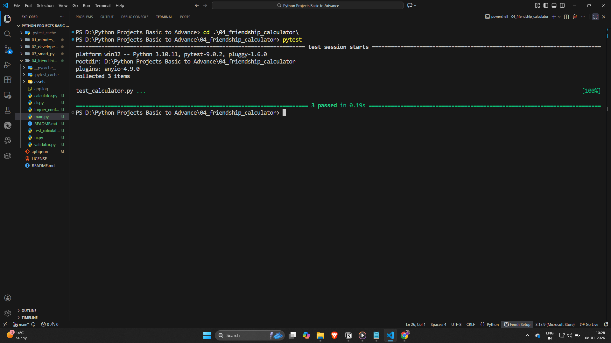
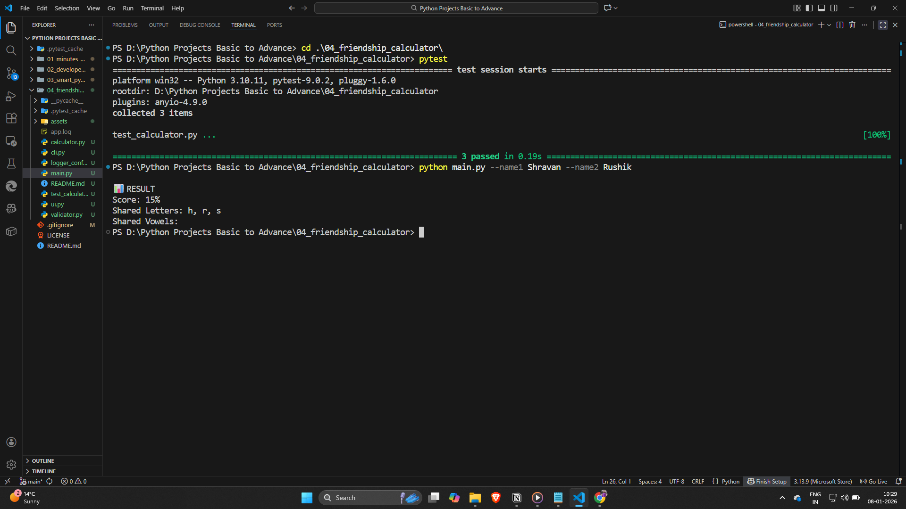
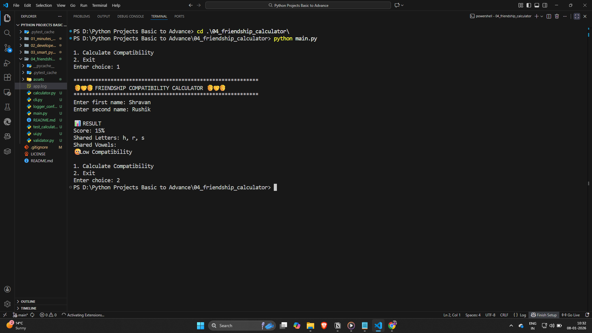
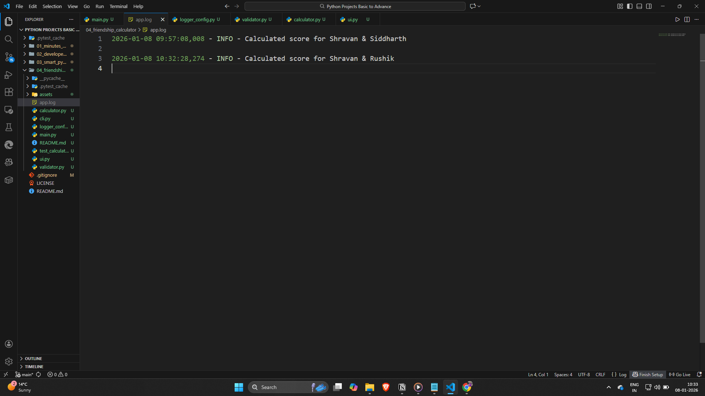

# 04 - Friendship Compatibility Calculator (CLI)

A modular, menu-driven Command Line Interface (CLI) application that calculates a friendship compatibility score based on shared characters and vowels in names. Though conceptually it is a simple project but wait for the interesting developer mindset beginning , this project is designed as an initiation step into professional Python development practices such as **MODULAR CODING**, **LOGGING**, **TESTING WITH PYTEST**, and CLI automation.

## 📝 Description

As a part of the **100+ Python Project Challenge**, this is the **4th project**.

The primary objective of this project is not just to calculate a compatibility score, but to **transition from basic scripting to structured software development** in Python.

This project introduces key industry-relevant practices like:
- Modular code organization
- Input validation using prompt-based functions
- Application-level logging
- Unit testing using `pytest`
- Command-line argument handling using `argparse`

It acts as a **foundation project** for becoming a Python developer rather than just a Python learner.

## 🚀 Features

* Dual Mode Execution
  - Interactive Menu-Driven CLI
  - Argument-Based CLI Tool using `argparse`

* Modular Code Structure
  - Separation of concerns (UI, validation, logic, logging)
  - Reusable business logic independent of UI

* Prompt-Based Input Validation
  - Ensures only valid alphabetic names are accepted
  - Prevents unexpected runtime errors

* Friendship Compatibility Logic
  - Shared letter analysis
  - Extra weightage for shared vowels
  - Normalized score capped at 100%

* Logging Support
  - Logs important application events
  - Helps in debugging and monitoring execution flow

* Unit Testing using Pytest
  - Automated verification of core logic
  - Ensures reliability and correctness of calculations

* Clean and User-Friendly Output
  - Clear score interpretation
  - Human-readable compatibility messages

## 🛠️ Tech-Stack

Language  : Python 3.13.9

Libraries / Tools :
- argparse
- logging
- pytest

Concepts :
- Functions
- Modular Programming
- Set Operations
- Input Validation
- Logging
- Unit Testing
- Command Line Interfaces (CLI)
- Conditional Logic

## ⚙️ Installation Guide

1. Clone the repository
    ```bash
    git clone https://github.com/shravanshidruk16/Python-Projects-Basic-To-Advance.git
    ```

2. Navigate to project directory
    ```bash
    cd Python-Projects-Basic-To-Advance
    cd 04_friendship_compatibility_calculator
    ```

3. Install required dependency
    ```bash
    pip install pytest
    ```

4. Run the application (Interactive Mode UI based)<br>
    This is the UI based part where the END-USER can interact
    ```bash
    python main.py
    ```

5. Run the application (CLI Mode using argparse )<br>
    Usually this part show the actual logic of shared letter and vowel to calculate compatibililty

    ```bash
    python main.py --name1 Alice --name2 Bob
    ```

6. Run unit tests<br>
    Implementation of pytest in basic projects gives a clear understanding of how a project is tested before giving it to end user
    ```bash
    pytest
    ```

## ▶️ How to Use

### Interactive Mode
1. Run `python main.py`
2. Choose the compatibility calculator option
3. Enter names when prompted
4. View score and compatibility interpretation

### CLI Mode
1. Run `python main.py --name1 <Name1> --name2 <Name2>`
2. Instantly receive compatibility results without prompts

### Testing Mode
1. Run `pytest`
2. All test cases are automatically discovered and executed


## 📸 **Demo**

## 1. Implementation of **pytest**


## 2. Implementation of **argparse**


## 3. Implementation of **main.py**


## 4. Implementation of **app.log (Logging)**



## 📌 Learning Outcomes

* Understood the importance of separating business logic from user interface
* Learned how prompt-based input validation improves robustness
* Gained hands-on experience with Python logging for real-world applications
* Learned how to write and run unit tests using pytest
* Understood how argparse is used in real CLI tools
* Transitioned from simple scripts to structured Python software

## 🎯 Why This Project Matters

Although the idea of a compatibility calculator is simple, this project represents:
- The **starting point of writing professional Python code**
- An introduction to **testing, logging, and automation**
- A mindset shift from “just making it work” to “making it reliable and maintainable”

This structure and approach can be reused in **all future Python projects**, including APIs, automation tools, and backend systems.

## ✍️ **Author**
* Shravan Shidruk  
* Challenge: **100+ Important Python Projects in 6 Months**
